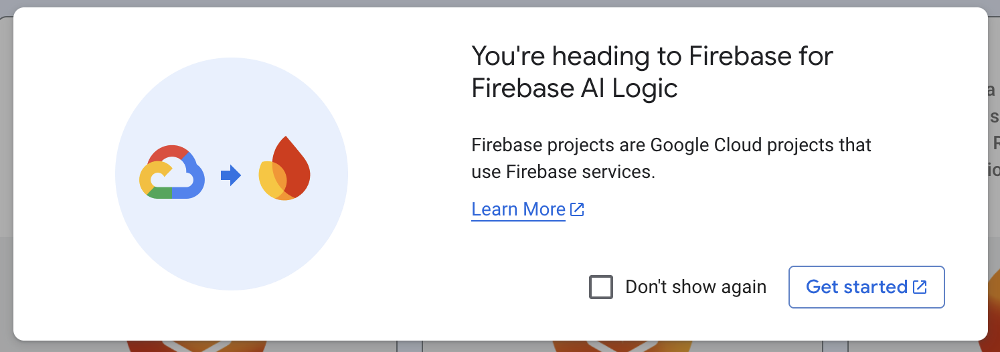
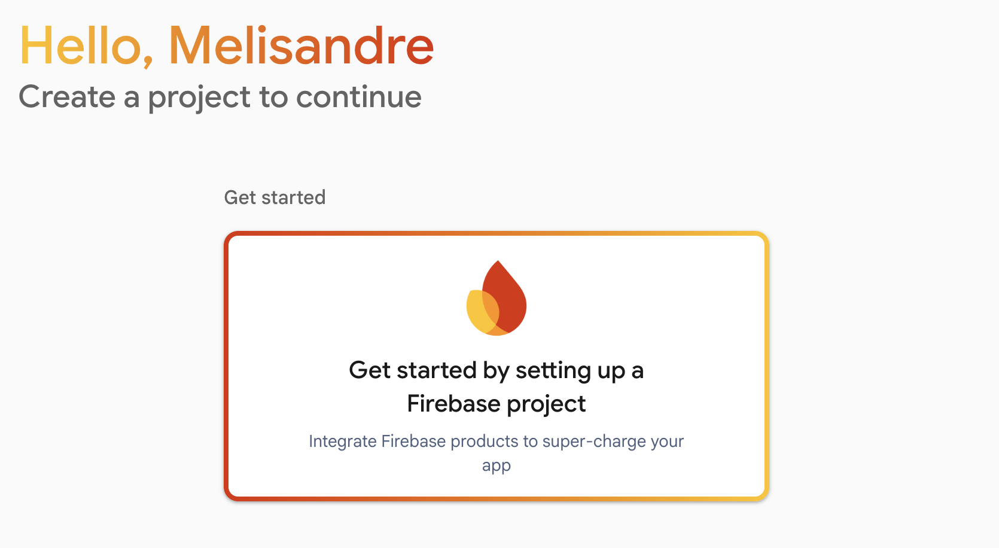
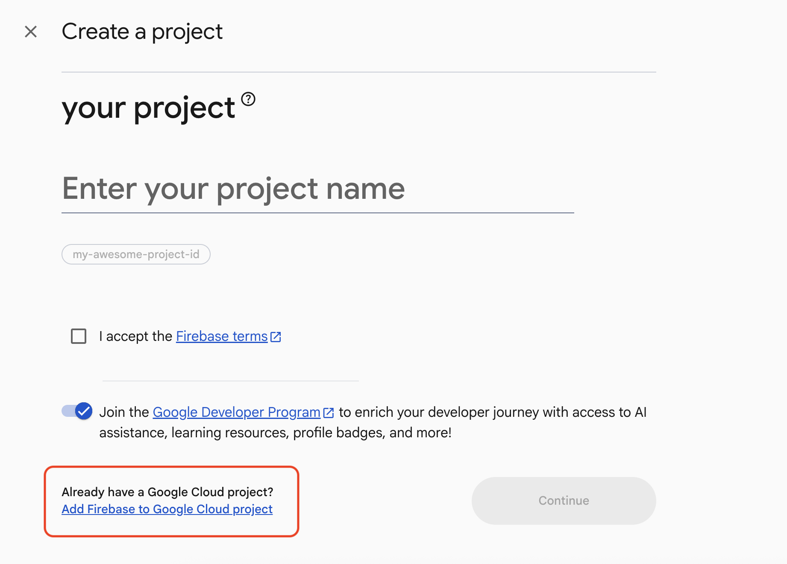
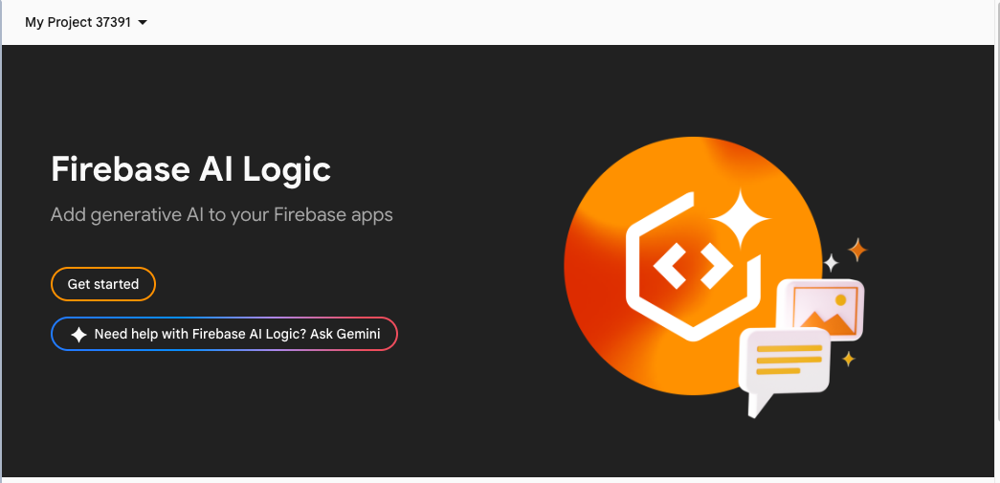
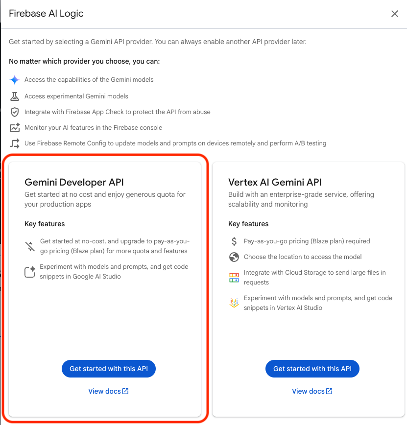
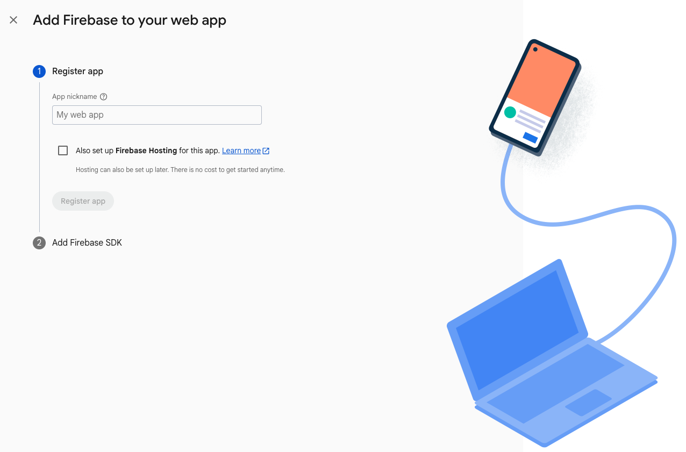
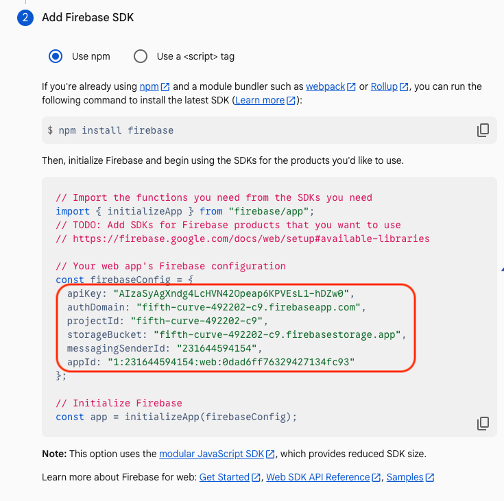
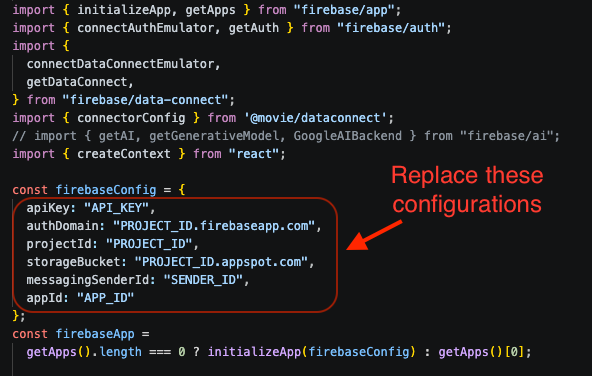

# **Firebase AI Logic でリアルタイムのローカル映画検索を構築する**

* **前提条件:** [Build with Firebase Data Connect (web)](https://firebase.google.com/codelabs/firebase-dataconnect-web) コードラボの完了。
* **トピック:** Gemini 3 Flash と Google 検索のグラウンディング（Grounding）を使用した「AI Logic」の実装。

## **1. 概要**

前回のコードラボでは、Firebase Data Connect と Cloud SQL を使用して堅牢な映画レビュー アプリケーションを構築しました。 `Movies`（映画）、`Reviews`（レビュー）、`Users`（ユーザー）のスキーマを定義し、それらをフィルタリングする UI を作成しました。

標準的なデータベース クエリは、「2024年に公開された映画を探す」といった構造化されたデータに対しては非常に優れています。 しかし、以下の 2 種類のユーザー ニーズには対応しきれないことがあります。

1.  **曖昧または概念的な意図:** 「温かいハグのような（ほっこりする）映画が見たい。」
2.  **リアルタイムの世界知識:** 「今、ダウンタウンの映画館で上映されている、これに似た映画は何？」

このモジュールでは、**Firebase AI Logic** を実装して、このギャップを埋めていきます。

### **アーキテクチャ**

アプリの大部分はそのまま残します。これらのユーザー ニーズを満たす新機能を実装するために、基本的なコンポーネントやデータベース スキーマを変更する必要はありません。

その代わりに、構築済みのものの上に「AI エージェント」機能を追加し、映画データベースにある作品と似た映画で、かつ近所や任意の場所でリアルタイムに上映されているものを検索できるようにします。

ここでの **AI エージェントの使用パターン** は以下の通りです。

1.  **Gemini 3 を使用して、現在リアルタイムで上映中の類似映画を検索する:** Firebase AI Logic と Gemini 3 を使用し、ユーザーが現在表示している映画のメタデータと希望する場所を提供することで、マルチモーダル検索を行います。
2.  **要件を満たすために AI エージェントが使用すべきツールを指定する:** （例: Google 検索の使用など）。
3.  **Gemini からアプリに返してほしいレスポンス データの形式を指定する:** アプリ内で表示しやすい形式を指定します。
4.  **レスポンス データを処理する:** Web アプリケーションのページに表示します。

### **構築するもの**

* **AI Logic サービス:** Google 検索ツールを使用して Gemini にクエリを送信するクライアントサイド サービス。
* **構造化プロンプティング:** コード内で利用可能な JSON データを AI に強制的に返させるテクニック。

## **2. Firebase コンソールで Firebase AI Logic API を有効にする**

今回のコードラボの一部として「Firebase AI Logic」を使用します。 以下の手順に従って、Cloud プロジェクトで Firebase AI Logic を有効にしてください。

1.  [Cloud コンソール](https://cloud.google.com/console)の製品検索バーで「Firebase」を検索し、検索結果から Firebase をクリックします。
2.  下にスクロールして、Firebase 製品リストの中から「Firebase AI Logic」を見つけます。
3.  [使ってみる (Get Started)] をクリックし、Firebase コンソールへの移動を承認します。

 

4.  Firebase コンソールに移動すると、以下のページが表示されます。

 

5.  [Firebase を使ってみる] をクリックすると、以下のプロジェクト セットアップ ページが表示されます。



5.  以下の点に注意して、プロジェクト セットアップの手順を進めてください。
    * 新しい Firebase プロジェクト名を入力して新規作成するのではなく、上のスクリーンショットでハイライトされている **「Google Cloud プロジェクトに Firebase を追加」** を選択し、以前に作成した Google Cloud プロジェクトを選択します。
    * 「Firebase の利用規約に同意する」にチェックを入れます。
    * 「Google アナリティクス」の設定では、このプロジェクトの Google アナリティクスを **OFF** にして [続行] をクリックします。
    * Firebase プロジェクトが設定され、以下のページが表示されます。



6.  [使ってみる] ボタンをクリックして、Firebase AI Logic を有効にします。

7.  Gemini Developer API で、[この API を使ってみる] をクリックします。 （Vertex AI Gemini API も利用可能ですが、現在はバグにより正常に動作しない可能性があります）。



以下の手順を完了してください。
  - [API を有効にする] をクリックします。
  - 「AI モニタリングを有効にする」ステップはスキップして構いません。
  - 「開始するにはアプリを追加してください」画面で、Web アプリのアイコンをクリックします。

  以下の画面が表示されます。

  

8.  Web アプリに任意の名前を付け、[アプリを登録] をクリックします。 次に、以下のような画面が表示されます。



9.  スクリーンショットに示されている、プロジェクト構成（Firebase configuration）セクションをコピーします。

10. この内容を、ローカル環境の `firebase.tsx (app/src/lib/firebase.tsx)` ファイル内にあるプロジェクト構成設定に貼り付けて置換します。



11. Firebase コンソールに戻り、[コンソールへ移動]、[続行] の順にクリックしてセットアップを完了します。

## **3. アプリケーションで Firebase AI Logic をセットアップする**

クライアント アプリケーションから Gemini モデルに直接アクセスするために、Firebase AI Logic SDK を使用します。

### **1. Firebase AI Logic SDK を有効にする**

1.  `firebase.tsx (app/src/lib/firebase.tsx)` の上部にある import 文に、以下を**追加**します。

```javascript
import { getAI, getGenerativeModel, GoogleAIBackend } from "firebase/ai";

## **4. 検索対応モデルの構成**

このステップでは、AIモデルの具体的な構成を定義します。ここでは単に標準的なテキストモデルをインスタンス化するだけではありません。**グラウンディング (Grounding)** を使用して、モデルに外部の世界へアクセスする能力を与えます。

**目標:** リアルタイムの情報を取得するために Google 検索を実行できる Gemini モデルを返す関数を作成します。これは、検索ツールを使用してアプリにレスポンスを返すエージェントとして機能します。

### **1. サービスの初期化**

firebase.tsx (app/src/lib/firebase.tsx) に、以下のコード行を追加します。

```javascript
const ai = getAI(firebaseApp);
```

これにより、getAI を使用して Firebase AI Logic サービスが初期化されます。これは、（API キーとプロジェクト ID を保持する）現在の firebaseApp 構成を AI SDK に渡し、アプリと Google のサーバー間の架け橋を作成します。

### **2. モデル構成の定義**

firebase.tsx (app/src/lib/firebase.tsx) に、以下のコード行を追加します。

```javascript
const ai = getAI(firebaseApp);

export const getSearchEnabledModel = () => {
return getGenerativeModel(ai, {
model: "gemini-3-flash-preview",
tools: [{ googleSearch: {} }]
});
};
```

getSearchEnabledModel 内で、getGenerativeModel を呼び出します。ここが重要なポイントです。2つの異なる構成要素を渡します。

**モデル (`model`):** `"gemini-3-flash-preview"` を選択しています。これは、使用したい大規模言語モデル (LLM) の特定のバージョンです。「Flash」モデルは速度と低レイテンシに最適化されており、ユーザー向けアプリケーションに優れています。

**ツール (`tools`):**

```javascript
tools: [{ googleSearch: {} }]
```

これが重要な追加要素です。`tools` 配列に `googleSearch` ツールを渡すことで、**グラウンディング** を有効にします。

* **これがない場合:** モデルは自身の学習データ（知識のカットオフ日があるもの）のみに依存します。
* **これがある場合:** モデルは、ユーザーが現在の出来事や特定の事実（例：「現在の Alpha の株価は？」）について質問したことを認識し、回答を生成する前に自動的に Google 検索を使用して答えを見つけることができます。

**重要なポイント:**

* ** `googleSearch: {}` **: この1行だけで、LLM に Google 検索からのライブ情報へのアクセス権を与え、本来なら知り得ない現在の上映時間に関する質問に答えられるようにします。

## **5. 映画館検索のプロンプトとインターフェースの構築**

検索対応モデルの構成が完了したので、それと対話するためのフロントエンドが必要です。このステップでは、この目的のために事前作成された `FindTheatresPage` コンポーネントを使用します。

**目標:** ユーザーの場所と日付を取得し、構造化されたプロンプトを Gemini に送信し、Google 検索経由で見つかった上映時間をレンダリングする React インターフェースを使用します。

`App.tsx (app/src/App.tsx)` で、以下の2行のコメントアウトを解除して FindTheatres.tsx ページを追加し、ルート App.tsx コンポーネントでページへのルートを有効にします。

```javascript
import FindTheatresPage from "./pages/FindTheatres";
//...<Route path="/findtheatres" element={<FindTheatresPage />} />
```

FindTheatres.tsx コンポーネント内の主要なロジックをいくつか分解してみましょう。

### **1. セットアップと状態管理**

ユーザーの入力を管理するために標準的な React フックを使用します。

* ** `useSearchParams` **: 前の画面から渡された映画のタイトルやタグを取得します（例：ユーザーが特定の映画ポスターで「上映時間を探す」をクリックした場合など）。
* ** `handleUseMyLocation` **: ユーザーが都市名を入力するよりも現在地を使用したい場合に、ブラウザ固有の Geolocation API を使用して正確な座標（`緯度、経度`）を取得します。

### **2. プロンプトエンジニアリング戦略**

このコンポーネントの中核は `handleSearch` 関数です。`prompt` をどのように構築しているかよく見てください。

```json
Context: User wants to see the movie matching "${tags || movieTitle}" in a theatre.
Location: ${location}
Date: ${date}

       Task:
       1. Find 2-3 movies similar to "${tags || movieTitle}" currently playing in this city.
       2. Return strict JSON format.

       JSON Schema:
       {
           "movies": [
               {
                   "title": "Movie Title",
                   "description": "Movie description",
                   "isTargetMovie": true,
                   "theatres": [
                       { "name": "Cinema Name", "showtimes": ["7:00 PM", "9:30 PM"] }
                   ]
               }
           ]
       }
```

**なぜこれを行うのでしょうか？**

* **コンテキストの注入:** `location` と `date` を明示的にプロンプトに送り込むことで、Google 検索ツールが「どこで」「いつ」検索すべきかを正確に把握できるようにします。
* **構造化出力 (JSON モード):** LLM は通常、会話形式のテキストを出力します。しかし、私たちの UI には映画館のリストをきれいに表示するために配列やオブジェクトが必要です。「厳密な JSON 形式」を明示的に要求し、**JSON スキーマ** を提供することで、モデルに検索結果を機械可読なコードにフォーマットさせます。

### **3. 実行と解析**

プロンプト内の JSON スキーマに基づいてモデルのレスポンスをマッピングするために、以下の2つのインターフェースを用意しています。

```javascript
interface Theatre {
name: string;
showtimes: string[];
}

interface MovieResult {
title: string;
isTargetMovie: boolean;
description: string;
theatres: Theatre[];
}
```

handleSearch 内で、呼び出しを実行します。

**モデルの呼び出し:** `model.generateContent(...)` が AI を起動します。AI は「現在の上映時間」のリクエストを確認し、外部データが必要であることを認識し、Google 検索を実行して結果を統合します。

**クリーニングと解析:**
```javascript
const cleanJson = text.replace(/json|/g, "").trim();
const data = JSON.parse(cleanJson);
```

`JSON.parse` がクラッシュしないように、AI が追加する可能性のあるマークダウンコードブロック（```json など）を取り除きます。

**グラウンディングメタデータ:** `response.candidates?.[0]?.groundingMetadata` を具体的に保存します。これには「証拠」、つまりデータが見つかった実際の映画館ウェブサイトへのリンクが含まれています。

### **4. UI レンダリング**

return ステートメントは、Tailwind CSS を使用して視覚的な表示を処理します。

* **入力セクション:** ユーザーが日付や場所を簡単に変更できる分割レイアウト。
* **結果ループ:** `movies` 配列をループして表示します。

## **6. 動作確認**

アプリケーションを起動します: `npm run dev`

映画をクリックし、「Find Theatres」ボタンを押します

日付と時間を入力し、「Find Showtimes」ボタンをクリックします

Gemini が、設定した場所で上映されている類似映画を返してくるのを待ちましょう！